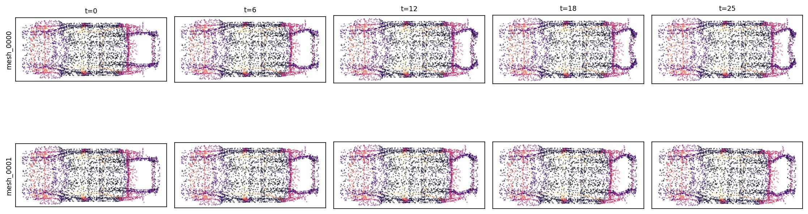

# Crash Simulation ETL

Process LS-DYNA crash simulation data through a Source → Filter → Sink
pipeline. Automotive crash simulations produce multi-timestep shell meshes
stored in the `d3plot` binary format. The pipeline reads these files,
removes non-deforming wall nodes, computes edge connectivity, logs mesh
metadata, converts fields to single precision, and writes the processed
meshes to disk.



The pipeline:

1. **WallNodeFilter** — removes non-deforming wall nodes whose maximum
   displacement variation across all timesteps falls below a threshold.
   This typically removes 30–60% of nodes, significantly reducing dataset
   size while preserving the structural response.
2. **EdgeComputeFilter** — extracts unique edges from cell connectivity
   and stores them in the mesh for use in graph-based models.
3. **MeshInfoFilter** — logs mesh metadata (node counts, cell counts,
   field names) and writes a JSON-lines summary.
4. **PrecisionFilter** — converts float64 fields to float32 to halve
   memory and storage requirements.
5. **MeshZarrSink** — writes each processed mesh as a compressed Zarr
   store optimized for ML training.

## Prerequisites

```bash
uv sync --extra mesh

# or with pip
pip install physicsnemo-curator[mesh] lasso-python
```

## Input Data

This pipeline expects LS-DYNA crash simulation data organized as run
directories, each containing `d3plot` binary files and a `.k` keyword file:

```text
input/crashsim/
├── run_10/
│   ├── d3plot           # Required: binary mesh/displacement header
│   ├── d3plot01         # Required: continuation state file(s)
│   ├── output.k         # Optional: part/section thickness definitions
│   └── hisnames.xml     # Optional: history variable names
├── run_11/
│   ├── d3plot
│   ├── d3plot01
│   ├── output.k
│   └── hisnames.xml
└── ...
```

### d3plot Files (Required)

LS-DYNA binary format containing:

- Node coordinates (reference configuration at t=0)
- Node displacements over time (temporal trajectory)
- Shell element connectivity (triangles and/or quads)
- Part IDs for each element
- Multiple timesteps of deformation data

The base `d3plot` file contains the header and initial state. Continuation
files (`d3plot01`, `d3plot02`, ...) store additional timestep data.

### .k File (Optional)

LS-DYNA keyword format (e.g., `output.k`) containing:

- `*PART` definitions linking parts to sections
- `*SECTION_SHELL` definitions with thickness values

If no `.k` file is found, node thickness defaults to 0 for all nodes.

### Obtaining Data

LS-DYNA crash simulation data (d3plot files) is typically generated by
running LS-DYNA finite element solvers on automotive crash models. If you
do not have your own simulation data, place any LS-DYNA d3plot output into
the expected directory structure above.

## Usage

```bash
# Basic usage (reads from ./input/crashsim, writes to ./output/crashsim)
python main.py

# Custom input/output directories
python main.py --input /path/to/d3plot/runs --output /path/to/output

# Adjust wall filtering threshold and parallelism
python main.py --wall-threshold 0.5 --workers 4
```

## Output Structure

```text
output/crashsim/
├── mesh_info.jsonl          # Per-mesh metadata (node/cell counts, fields)
├── mesh_0000.zarr/          # Compressed Zarr store (run_10)
│   └── ...
├── mesh_0001.zarr/          # Compressed Zarr store (run_11)
│   └── ...
└── ...
```

## Plotting

After running the pipeline, visualize mesh deformation over timesteps:

```bash
# Default: 5 timestep columns from Zarr output
python plot.py

# Custom options
python plot.py --output output/crashsim --timesteps 8 --out sample.jpg
```

This produces a JPEG with one row per run and one column per timestep,
showing the XY projection of the mesh point cloud colored by Z coordinate.

## References

- [PhysicsNeMo Crash Training Example](https://github.com/NVIDIA/physicsnemo/blob/main/examples/structural_mechanics/crash/README.md)
  — Model training guide
- [PhysicsNeMo-Curator Documentation](https://github.com/NVIDIA/physicsnemo-curator)
  — General ETL framework documentation
