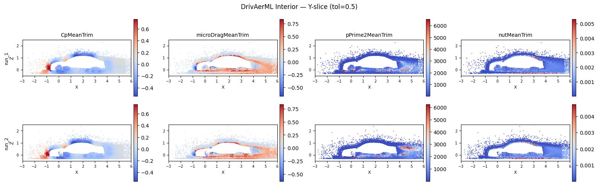

# DrivAerML End-to-End ETL

Process [DrivAerML](https://huggingface.co/datasets/neashton/drivaerml)
automotive CFD meshes through a complete Source → Filter → Sink pipeline.



The pipeline:

1. **BoundaryInjectionFilter** — synthesizes the rectangular wind-tunnel
   boundaries (`inlet`, `outlet`, `slip`, `no_slip`) the dataset ships
   without and injects them into each `DomainMesh` alongside the existing
   `vehicle` surface (via `BoxTunnelBoundaries`, inferring the floor height
   per sample). STL meshes pass through unchanged.
2. **RandomPermutationFilter** — shuffles point and cell ordering to
   remove spatial bias before training.
3. **MeshSink** — writes each mesh in PhysicsNeMo's native format
   (`.pdmsh` for DomainMesh, `.pmsh` for plain Mesh), grouped into
   per-run subdirectories.

`DrivAerMLSource` already downcasts to float32, so a separate
`PrecisionFilter` is not needed. Pass `--check-watertight` to log
`DomainMesh.check_boundary_watertight` after injection.

## Prerequisites

```bash
uv sync --extra mesh --extra loky

# or with pip
pip install physicsnemo-curator[mesh,loky]
```

## Download the Dataset

DrivAerML is hosted on HuggingFace at
[neashton/drivaerml](https://huggingface.co/datasets/neashton/drivaerml).
The volume files are large (~50 GB each), so it is recommended to
explicitly manage the download with the HuggingFace CLI rather than
relying on streaming.

> **Warning:** The full dataset is approximately **12 TB** (500 runs,
> ~24 GB each). A single run downloads ~24 GB of volume, surface, and
> geometry data. Ensure you have sufficient disk space before
> downloading.

```bash
uv pip install huggingface_hub[cli]

# Download specific runs (adjust --include for your needs)
uv run hf download neashton/drivaerml \
    --repo-type dataset \
    --include "run_1/*" --include "run_2/*" \
    --local-dir input/drivaerml
```

This creates an `input/drivaerml/` directory with per-run subdirectories
containing mesh data, geometry, and metadata files:

```text
input/drivaerml/
├── run_1/
│   ├── volume_1.vtu           # Volume mesh (cell centroids + fields)
│   ├── boundary_1.vtp         # Boundary surface (triangulated)
│   ├── drivaer_1.stl          # Vehicle geometry (multi-part STL)
│   ├── geo_parameters_1.csv   # Geometric parameters
│   ├── geo_ref_1.csv          # Reference geometry
│   ├── force_mom_1.csv        # Force/moment data
│   ├── force_mom_constref_1.csv
│   ├── images/                # Visualization images
│   └── slices/                # Cross-section slices (.vtp)
│       ├── xNormal_*.vtp      # X-normal slice planes
│       ├── yNormal_*.vtp      # Y-normal slice planes
│       └── zNormal_*.vtp      # Z-normal slice planes
├── run_2/
│   └── ...
└── ...
```

## Usage

```bash
# Basic usage (reads from ./input/drivaerml, writes to ./output/drivaerml)
python main.py

# Custom input/output directories
python main.py --input /path/to/drivaerml --output /path/to/output

# Limit to specific number of workers
python main.py --workers 4

# Process only the first N runs (handy for a quick test)
python main.py --limit 2

# Verify the synthesized boundary surface is watertight (informational)
python main.py --check-watertight
```

Each output `domain_{run}.pdmsh` carries the interior, the `vehicle`
surface, and the injected `inlet` / `outlet` / `slip` / `no_slip`
boundaries.

## Output Structure

```text
output/drivaerml/
├── stats.parquet                        # Per-field statistics (merged)
├── run_1/
│   ├── domain_1.pdmsh/                  # DomainMesh: interior + surface
│   ├── drivaer_1.stl.pmsh/              # STL geometry
│   └── drivaer_1_single_solid.stl.pmsh/ # Merged STL
├── run_2/
│   ├── domain_2.pdmsh/
│   ├── drivaer_2.stl.pmsh/
│   └── drivaer_2_single_solid.stl.pmsh/
└── ...
```

## Plotting

After running the pipeline, visualize interior flow fields for processed
runs:

```bash
# Default: auto-detect fields, Y-slice, 2 runs
python plot.py

# Custom options
python plot.py --output output/drivaerml --runs 3 --fields pMeanTrim nutMeanTrim --slice-axis y --out sample.jpg
```

This produces a JPEG with one row per run and one column per field,
showing a Y-normal slice through the interior flow colored by field
magnitude.

## References

- [DrivAerML Dataset](https://huggingface.co/datasets/neashton/drivaerml) — HuggingFace page
- [AhmedML ETL](../ahmedml/) — Similar pipeline for AhmedML dataset
- [PhysicsNeMo-Curator Documentation](https://github.com/NVIDIA/physicsnemo-curator) — Framework docs
