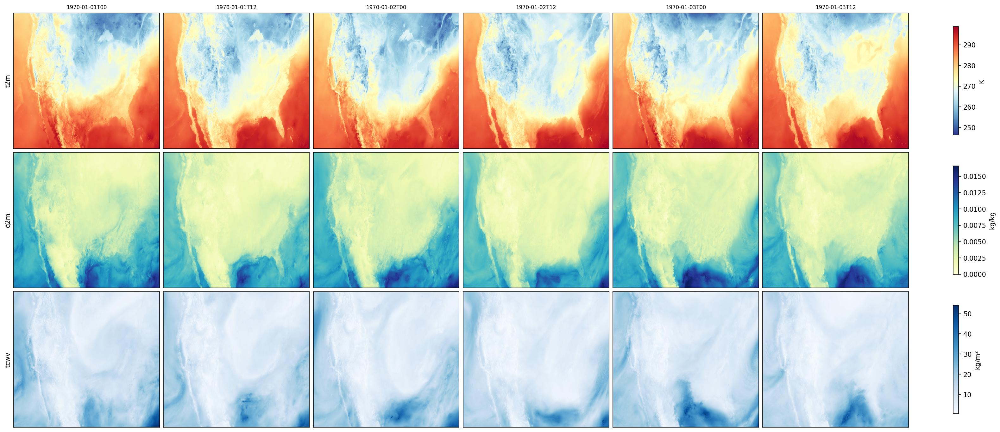

# NOAA High-Resolution Rapid Refresh (HRRR) Analysis Data ETL

Curate [HRRR][hrrr] 3 km hourly analysis data through a Source -> Filter -> Sink
pipeline, fetching 3 days of data from AWS cloud storage.



The pipeline:

1. **DataArrayStatsFilter** -- computes running statistics (mean, variance,
   skewness, min, max) per spatial grid point using Welford's online
   algorithm.
2. **ZarrSink** -- writes each timestep to a Zarr v3 store with one
   group per variable and dimensions `(time, hrrr_y, hrrr_x)`.

## Prerequisites

```bash
uv sync --extra da

# or with pip
pip install physicsnemo-curator[da]
```

Required packages: `xarray`, `earth2studio`, `zarr>=3.0`.

## Data Access

HRRR data is fetched on-the-fly from cloud object stores ([AWS][aws], Google, or
NOMADS) via earth2studio. **No manual download is required** -- the source
streams data directly from cloud storage.

> **Note:** The AWS backend requires no authentication for HRRR archive
> data. Downloaded chunks are cached locally at
> `~/.cache/earth2studio/hrrr/` by default. Set the
> `EARTH2STUDIO_CACHE` environment variable to override the cache location.

Available variables used in this example:

| Variable | Description                       |
|----------|-----------------------------------|
| `t2m`   | 2-metre temperature (K)           |
| `q2m`   | 2-metre specific humidity (kg/kg) |
| `tcwv`  | Total column water vapour (kg/m²) |

## Usage

The example script uses the `process_pool` backend internally via
`run_pipeline(..., backend="process_pool")`.

```bash
# Default: 3 days starting 2024-01-01, 8 workers, AWS source
python main.py

# Custom start date and duration
python main.py --start-date 2024-06-15 --days 3 --output /path/to/output

# Adjust worker count
python main.py --workers 4

# Use alternative source (google or nomads)
python main.py --source google
```

## Output Structure

```text
output/hrrr_analysis/
├── stats.zarr/          # Per-variable statistics (mean, var, skew, min, max)
│   ├── t2m/
│   ├── q2m/
│   └── tcwv/
└── dataset.zarr/        # Full dataset (time, hrrr_y, hrrr_x) per variable
    ├── t2m/
    ├── q2m/
    └── tcwv/
```

Each variable group in `dataset.zarr` contains a 3-D array with
dimensions `(time=n, hrrr_y=1059, hrrr_x=1799)` at 3 km resolution on
a Lambert conformal grid.

## Plotting

After running the pipeline, visualize the analysis fields at regular
time intervals:

```bash
# Default: t2m, q2m, and tcwv at 12-hour steps
python plot.py

# Custom interval and output path
python plot.py --output output/hrrr_analysis --step 6 --out hrrr_fields.jpg
```

This produces a JPEG with three rows (t2m, q2m, tcwv) and one column per
selected timestep, plotted on the native HRRR grid with appropriate
colormaps for each variable.

## References

[hrrr]: https://www.nco.ncep.noaa.gov/pmb/products/hrrr/
[aws]: https://aws.amazon.com/marketplace/pp/prodview-yd5ydptv3vuz2
